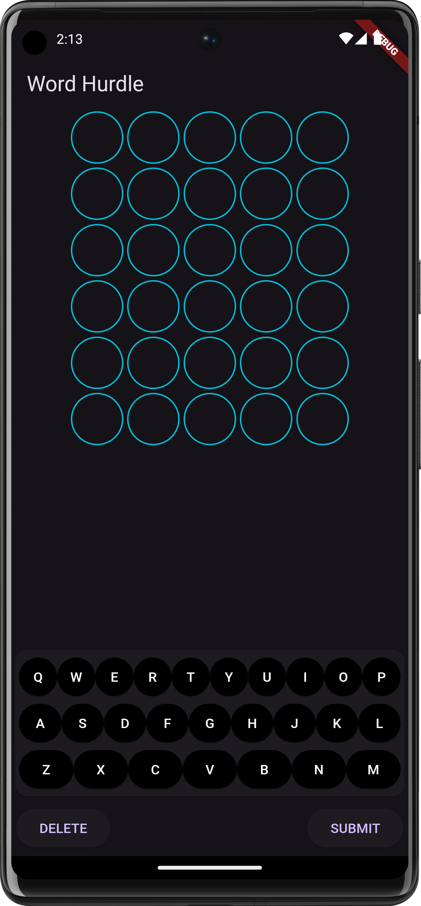
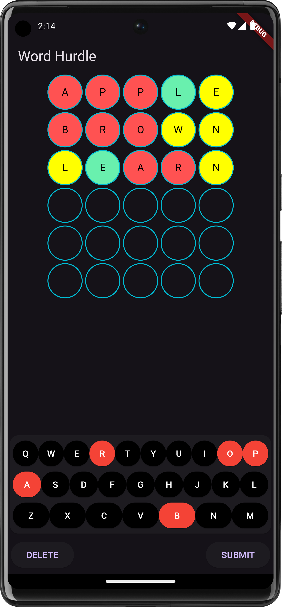
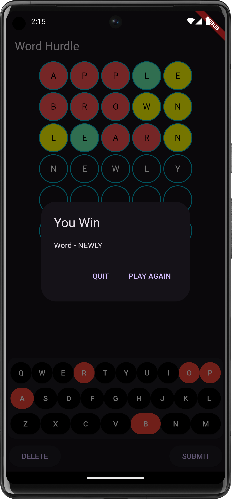

# Word Hurdle Game

A Flutter-based word puzzle game inspired by Wordle! The goal of the game is to guess the target word within a limited number of attempts. Each attempt provides feedback on how close your guess is to the target word, indicating which letters are in the correct position or exist in the word but are in the wrong place.

## Features

- **Word Matching Logic**: Compares user guesses with the target word.
- **Feedback on Letters**:
  - **Green**: Correct letter in the correct position.
  - **Yellow**: Correct letter in the wrong position.
  - **Red**: Letter does not exist in the target word.
- **Attempt Limit**: Players have a limited number (6) of attempts to guess the word.
- **Dynamic Feedback**: Letters are highlighted based on their correctness in each guess.
- **Mobile Friendly**: Built using Flutter, optimized for mobile screens.

## Screenshots

<p align="center">


 
</p>

## Installation

1. Clone the repository:
   ```bash
   git clone https://github.com/PrakEntech/WordHurdleGame.git
   ```
2. Navigate into the project directory:
   ```bash
   cd WordHurdleGame
   ```
3. Install the dependencies:
   ```bash
   flutter pub get
   ```
4. Run the app:
   ```bash
   flutter run
   ```

## How to Play

1. Start the game by entering your first word guess.
2. After each guess, the letters will be highlighted based on their correctness:
   - **Green**: The letter is in the correct position.
   - **Yellow**: The letter exists in the word but is in the wrong position.
   - **Red**: The letter does not exist in the target word.
3. Keep guessing until you either guess the correct word or run out of attempts.

## Word Matching Logic

This game uses a letter-by-letter comparison algorithm to provide dynamic feedback:
- It avoids duplicate highlighting for repeated letters in the guess or target word.
- Correct guesses are prioritized for accurate letter feedback.
